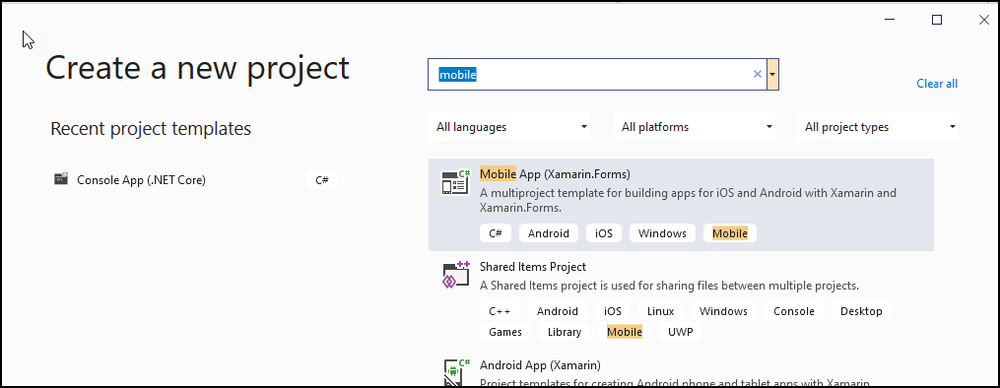
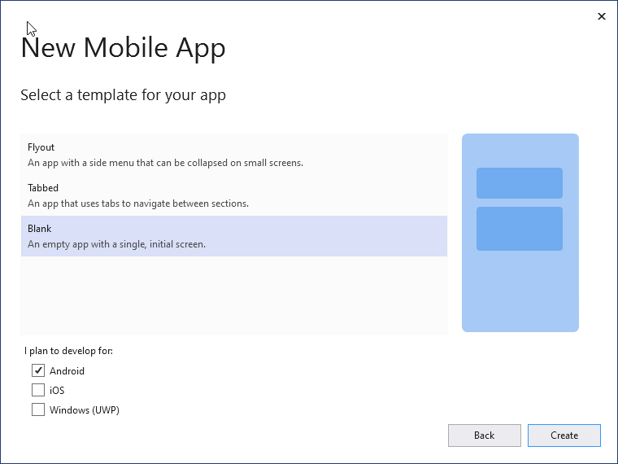
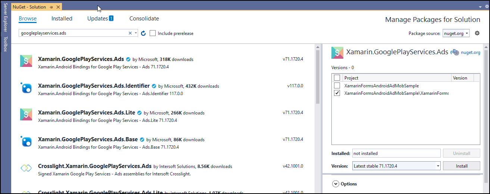

# Adding Google AdMob ads to a Xamarin Forms Android app

Recently, I spent some time banging my head against the wall attempting to figure out how to add AdMob ads to my app. I read through all of the existing recommended blog posts and articles on the subject. I delved into stack overflow. I even perused the official documentation. 

I decided that I needed to simplify and see if I could get it working in a sample app; then move it to my full app. (Spoiler alert I succeeded.) 

I am sharing what worked for me.

I created an AdMob account at https://admob.google.com/home/

I set up an and App. For more information, see https://support.google.com/admob/answer/9989980?visit_id=637411851150652490-2677892110&rd=1.

I created an Add Unit. For more information, see https://support.google.com/admob/answer/6128738?visit_id=637411851150652490-2677892110&rd=1.

**NOTE**: You get both an **App ID**, created when you set up the app, and an **Ad Unit ID**, created when you create an Add Unit. I failed to Grok the difference, as well as where and when they important.
The **App ID** is as you might surmise and application level identifier. You set it once for the entire app. In my case, I set in the AdroidManifest, but you can also set set it in code during the start up of your app.
The **Ad Unit ID** is the identifier for a specific instance of an Ad at specified location if your UI. If I understand the AdMob documentation correctly, you can use multiple **Ad Unit ID**s in the same app.

I created a Blank Android Mobile App called AdMobSample.



I selected the "Blank" template to create what Microsoft calls an "empty app". In reality, it creates a simple single page app the is useful when you are trying out new techniques. At this time, I am only interested in Android apps so I made sure to uncheck iOS which is typically checked by default.



I used NuGet to add the `Xamarin.GooglePlayServices.Ads` plug-in to the app. 

**Note**: I initially made the mistake of installing it for all the projects in the app. This caused the plug-in to fail to install with an error message that the plug-in is not compatible with .NET 2.0.



In the MainActivity.cs file of the Android Project, I added a using statement to reference Ads namespace:

`using Android.Gms.Ads;`

In the `OnCreate` method, I initialized the ads by calling `MobileAds.Initialize`:

```csharp
base.OnCreate(savedInstanceState);

MobileAds.Initialize(ApplicationContext);
Xamarin.Essentials.Platform.Init(this, savedInstanceState);
global::Xamarin.Forms.Forms.Init(this, savedInstanceState);
LoadApplication(new App());
```


I modified the AndroidManifest.xml file located in the Properties folder of the Android project to specify the **App ID** for the app:

```xml
<?xml version="1.0" encoding="utf-8"?>
<manifest xmlns:android="http://schemas.android.com/apk/res/android" android:versionCode="1" android:versionName="1.0" package="com.companyname.admobsample">
    <uses-sdk android:minSdkVersion="21" android:targetSdkVersion="28" />
    <application android:label="AdMobSample.Android" android:theme="@style/MainTheme">
      <activity android:name="com.google.android.gms.ads.AdActivity" android:configChanges="keyboard|keyboardHidden|orientation|screenLayout|uiMode|screenSize|smallestScreenSize" android:theme="@android:style/Theme.Translucent" />
	  <!-- Set set this to YOUR APP ID-->
      <meta-data android:name="com.google.android.gms.ads.APPLICATION_ID" android:value="ca-app-pub-xxxxxxxxxxxxxxxx~yyyyyyyyyy" />
      <meta-data android:name="com.google.android.gms.ads.AD_MANAGER_APP" android:value="true" />
    </application>
    <uses-permission android:name="android.permission.ACCESS_NETWORK_STATE" />
</manifest>
```

To display the ad I had to add a view in the shared project. For more information on implementing a view, see [Implementing a View](https://docs.microsoft.com/en-us/xamarin/xamarin-forms/app-fundamentals/custom-renderer/view).

In the shared project I added AdMobView.cs:

```csharp
using Xamarin.Forms;

namespace AdMobSample.controls
{
	public class AdMobView : View
	{
		public static readonly BindableProperty AdUnitIdProperty = BindableProperty.Create(
				   nameof(AdUnitId),
				   typeof(string),
				   typeof(AdMobView),
				   string.Empty);

		public string AdUnitId
		{
			get => (string)GetValue(AdUnitIdProperty);
			set => SetValue(AdUnitIdProperty, value);
		}
	}
}
```

To create the view for Android I had to a custom view renderer. After the view is created you call `SetNativeControl()` to display it. For more information on view renderers, see [](https://docs.microsoft.com/en-us/xamarin/xamarin-forms/app-fundamentals/custom-renderer/).

In Android project I added AdMobViewRenderer.cs:

```csharp
using System.ComponentModel;
using AdMobSample.controls;
using AdMobSample.Droid;
using Android.Content;
using Android.Gms.Ads;
using Android.Widget;
using Xamarin.Forms;
using Xamarin.Forms.Platform.Android;

[assembly: ExportRenderer(typeof(AdMobView), typeof(AdMobViewRenderer))]
namespace AdMobSample.Droid
{
	public class AdMobViewRenderer : ViewRenderer<AdMobView, AdView>
	{
		public AdMobViewRenderer(Context context) : base(context) { }

		protected override void OnElementChanged(ElementChangedEventArgs<AdMobView> e)
		{
			base.OnElementChanged(e);

			if (e.NewElement != null && Control == null)
			{
				SetNativeControl(CreateAdView());
			}
		}

		protected override void OnElementPropertyChanged(object sender, PropertyChangedEventArgs e)
		{
			base.OnElementPropertyChanged(sender, e);

			if (e.PropertyName == nameof(AdView.AdUnitId))
				Control.AdUnitId = Element.AdUnitId;
		}

		
		private AdView CreateAdView()
		{
			var adView = new AdView(Context)
			{
				AdSize = AdSize.SmartBanner,
				AdUnitId = Element.AdUnitId
			};

			adView.LayoutParameters = new LinearLayout.LayoutParams(LayoutParams.MatchParent, LayoutParams.MatchParent);

			adView.LoadAd(new AdRequest
							.Builder()
							.Build());

			return adView;
		}
	}
}
```

Finally, I modified the MainPage.xaml by adding a reference to the view `xmlns:local="clr-namespace:AdMobSample.controls"` and I added the control in a stacklayout as follows `<local:AdMobView AdUnitId="ca-app-pub-3940256099942544/6300978111" WidthRequest="320" HeightRequest="50"/>`:

```xml
<?xml version="1.0" encoding="utf-8" ?>
<ContentPage xmlns="http://xamarin.com/schemas/2014/forms"
             xmlns:local="clr-namespace:AdMobSample.controls"
             xmlns:x="http://schemas.microsoft.com/winfx/2009/xaml"
             x:Class="AdMobSample.MainPage">
    <StackLayout>
        <Label Text="Display an Admob Banner!" 
           HorizontalOptions="Center"
           VerticalOptions="CenterAndExpand" />
        <!-- Place the Admob controls here -->
        <local:AdMobView AdUnitId="ca-app-pub-3940256099942544/6300978111" WidthRequest="320" HeightRequest="50"/>
    </StackLayout>
</ContentPage>
```
This displays a test ad using the Google supplied Test **Ad Unit ID** `ca-app-pub-3940256099942544/6300978111`. For more information on test ad units, see [Test Ads](https://developers.google.com/admob/android/test-ads).

**Note**: If you do not specify a width and Height request the ad does not display.
